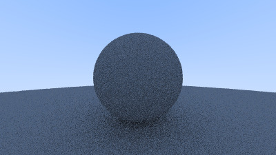

# Ray Tracer

## Showcase



## Running the project

### Pre-requirements

- CMake

```shell
cmake -B build && cmake --build build && ./build/ray_tracer > image.ppm && convert image.ppm assets/image.png
```

Or just create an alias:

```shell
alias run='cmake -B build && cmake --build build && ./build/ray_tracer > image.ppm && convert image.ppm assets/image.png'
```
